# 🔄 Diagramme de flux - SocialHub Global V5

## 📊 Flux complet du workflow

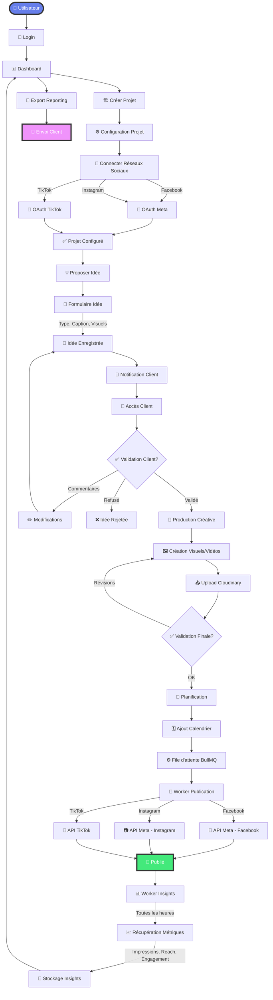

---

## 🎯 Détail des étapes

### 1️⃣ Authentification & Setup
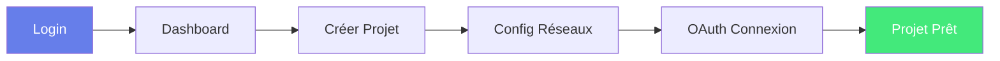

### 2️⃣ Proposition & Validation
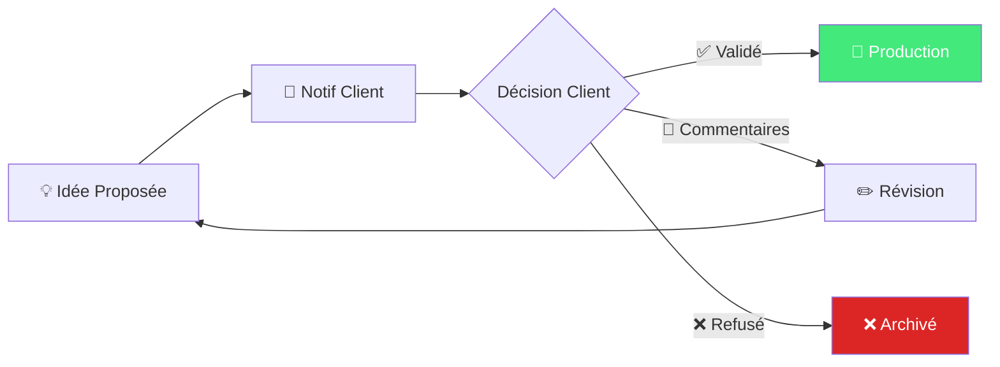

### 3️⃣ Production & Publication
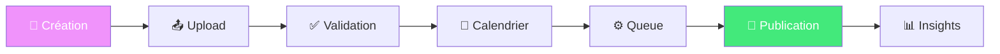

### 4️⃣ Analytics & Reporting
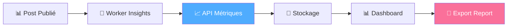

---

## 🔀 Flux par acteur

### 👨‍💼 Digital Marketer
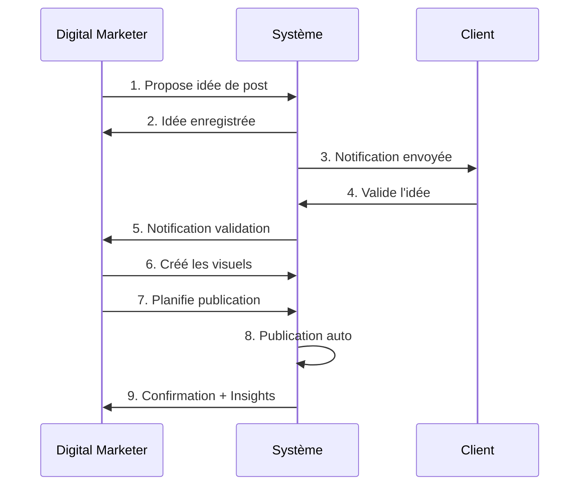

### 👤 Client
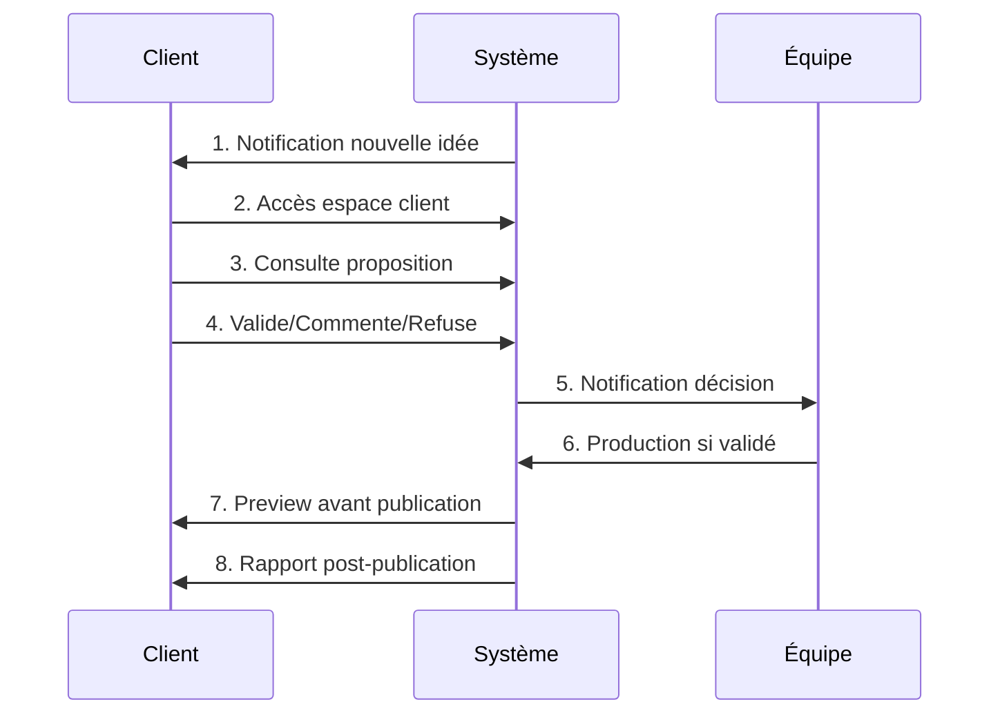

### 🎨 Créatif
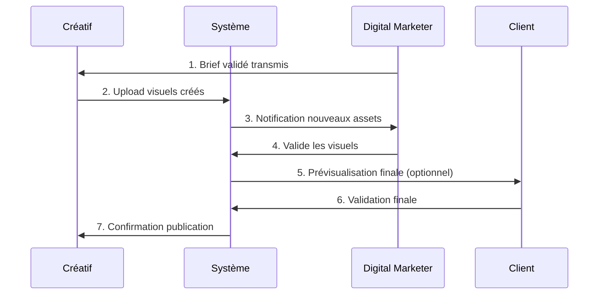

---

## 🏗️ Architecture système

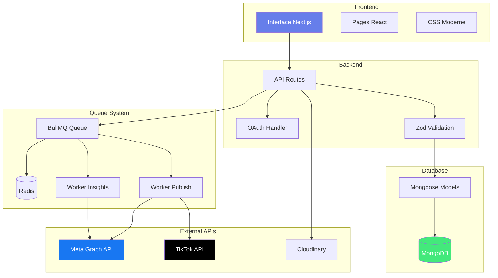

---

## 📱 Flow de publication automatique

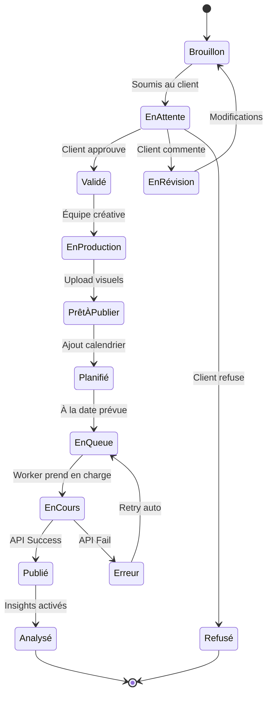

---

## 🔄 Cycle de vie d'un post

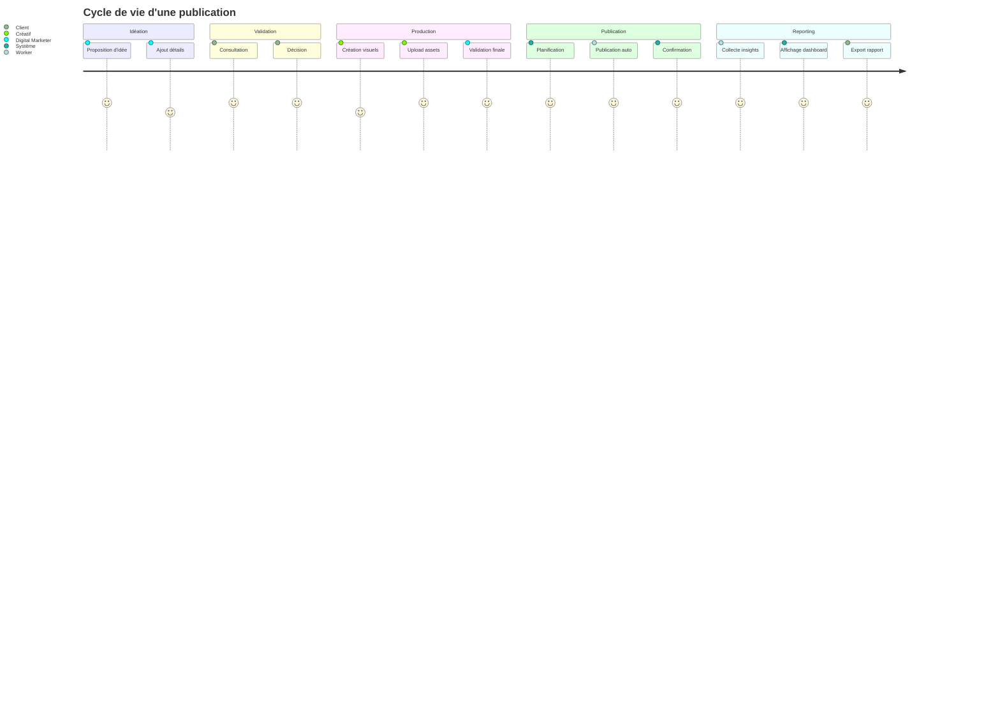

---

## 🎯 Points clés du workflow

### ✅ Automatisation
- Publication programmée sans intervention
- Retry automatique en cas d'erreur
- Insights auto-refresh toutes les heures
- Notifications à chaque étape

### 🤝 Collaboration
- Workflow transparent équipe ↔ client
- Historique complet des échanges
- Validation en temps réel
- Commentaires intégrés

### 📊 Suivi
- Statuts en temps réel
- Métriques détaillées
- Reporting automatique
- Export PDF/Excel

---

**Visualisation complète du workflow SocialHub Global V5**

